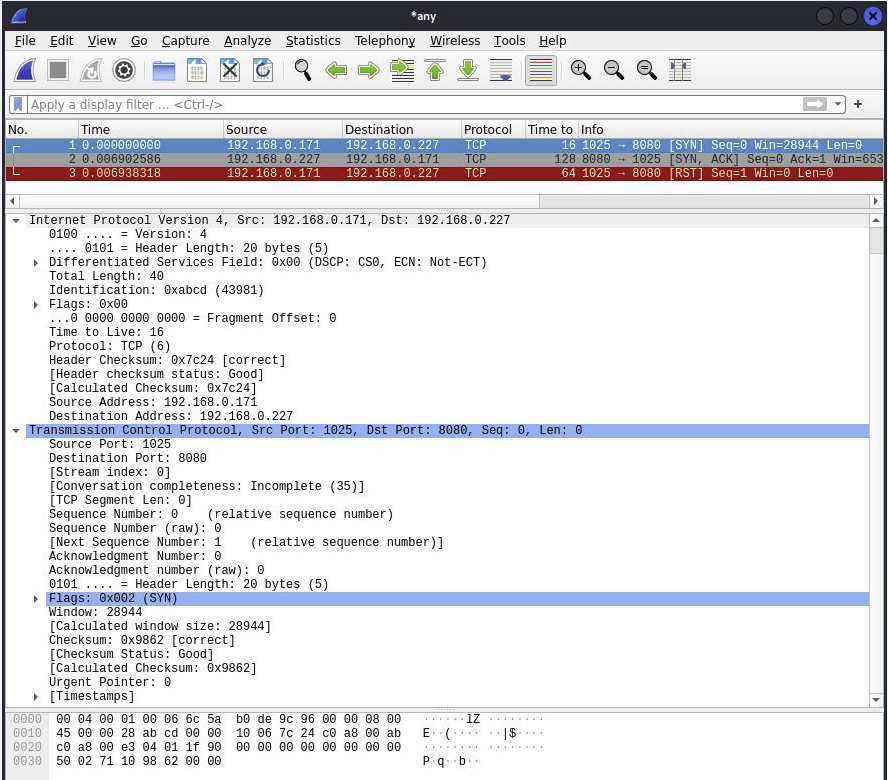

# Raw TCP/IP packet
> Create raw TCP/IP packets and send it over your network.

## Table of Contents
* [General Info](#general-information)
* [Wireshark](#wireshark)
* [Usage](#usage)
* [Acknowledgments](#acknowledgements)

## General Information

The puropse of this project is better understanding how TCP and IP packets are created and 
what mean those numbers when catching it with Wireshark.

## Usage
Open terminal window in project directory and type:

`$ make`

After compiling, start Wireshark and run TCPIP_packet with arguments:

`$ ./TCPIP_packet source_ip destination_ip TTL source_port destination_port tcp_flags`

Run  `$ ./TCPIP_packet`  without any arguments to see info about tcp flags.
   

This is example from my network:

`$ ./TCPIP_packet 192.168.0.171  192.168.0.227  16 1025 8080  000000010`

the output is raw hexadecimal TCP/IP packet:

`4500 0028 abcd 0000 1006 7c24 c0a8 00ab c0a8 00e3 0401 1f90 0000 0000 0000 0000 5002 7110 9862 0000`

 and destination ip number: `192.168.0.227`   
  

You can pipe it with Python script ( sudo is required, because it operates on raw sockets):

`$ ./TCPIP_packet 192.168.0.171  192.168.0.227  16 1025 9000  000000010 | sudo python send.py`

The packet is created and send from ip: `192.168.0.171`, port: `1025` with TTL: `16` to destination ip: `192.168.0.227`, 
on port: `8080` and SYN flag set.
  

If you don't have server in your network you can run server on your machine with Linux command:

`$ python -m http.server --bind 127.0.0.1 8080 `

This command opens server on port 8080.
After staring server you can send raw packet with command:

`$ ./TCPIP_packet 192.168.0.171  127.0.0.1  16 1025 8080  000000010 | sudo python send.py`

## Wireshark

Catching packets with Wireshark. 
Here is example of starting three-way-handshake.

1. Packet with SYN sent from client to server
2. The server responds with SYN, ACK
3. The client responds with RST flag beacuse this is not full TCP connection.

## Acknowledgements

- This project was based on [this tutorial](https://inc0x0.com/tcp-ip-packets-introduction/tcp-ip-packets-3-manually-create-and-send-raw-tcp-ip-packets/).
- IMPORTANT: Use this only on network which you own, you don't want to get into trouble.
